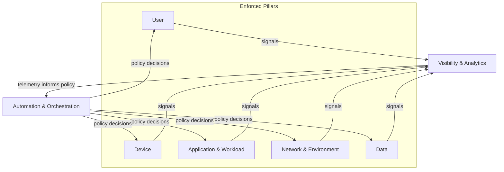
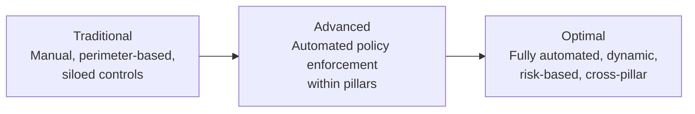
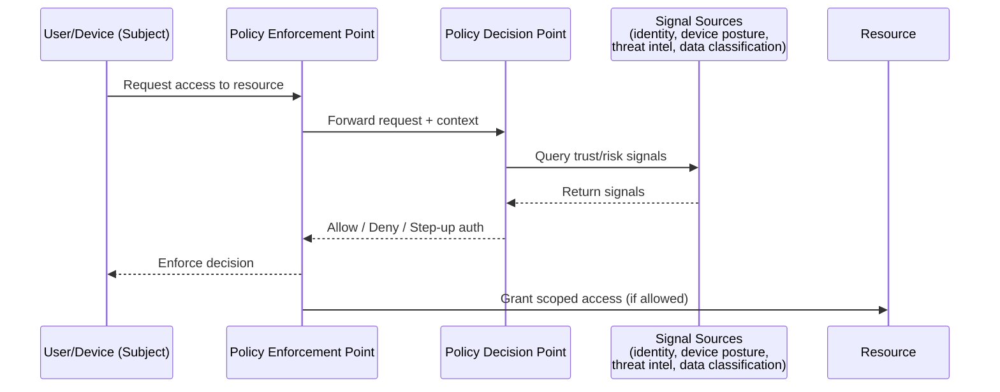

# Diagrams

Rendered with [Mermaid](https://mermaid.js.org/), which GitHub renders
natively in markdown — no extra tooling required.

## Pillar interaction

Automation & Orchestration and Visibility & Analytics are cross-cutting: they
consume signals from, and push policy to, the other five pillars.

## Maturity progression

## PDP / PEP request flow (NIST SP 800-207)

